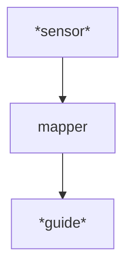

# general pattern


# Plugin

- Here is how you run the sensor
- Here is how you map the seonors output to our format
- Here are the prompts you give for those errors

# Sensor

- Multi sensors
- Cascading sensors
- External wrapper 
- Fail fast sensor
- Recent file only sensor
- Cache sensor 

## API pattern
sensor -->
```json
[
  {
    "filePath": "/repo/src/billing.ts",
    "messages": [
      {
        "ruleId": "max-params",
        "message": "Function 'chargeCard' has too many parameters (5). Maximum allowed is 3.",
        "line": 2,
        "column": 22,
        "severity": 2
      }
    ]
  }
]
```

```json
[
  {
    "errorKey": "max-params",
    "details": 
      {
      }
  }
]
```

json, fixer map <key:function> --> mapper --> function(details)

function(details) --> guide --> errorcode + console out
guide

### error code

0: this error is fixed
1: error not fixed yet


## habit hooks implementation

Habit Hooks is a pre-commit/agent quality gate. It does **not** auto-edit
code — its "fix" stage is *coaching*: it hands the agent (or human) the
guidance needed to make the fix itself. The three abstract stages map
onto concrete modules as follows.

```mermaid
graph TD
    subgraph sensor
        A[runner.ts<br/>discover · scope · filter · baseline] --> B[check wraps<br/>eslint · knip · jscpd · comment]
        B --> C[Violation&#91;&#93;<br/>raw smells]
    end
    subgraph mapper
        C --> D[rules/registry.ts<br/>defaults + user config -> Rule&#91;&#93;]
        C --> E[prompts/registry.ts<br/>ruleId -> CoachingPrompt]
    end
    subgraph guide
        D --> F[reporter.ts<br/>group · render]
        E --> F
        F --> G[prompts/*.md guidance<br/>+ exit code 0/1]
    end
```



### sensor — *find the smells*

Turns the working tree into a flat list of raw `Violation`s
(`src/types.ts`). Orchestrated by `src/runner.ts`:

1. **discover** — `discoverFiles` globs `**/*.{ts,tsx,js,mjs,cjs}`
   (minus `node_modules`/`dist`/`coverage`).
2. **scope** — `resolveScope` (`src/git/`) narrows rules marked
   `changedFilesOnly` to the git-changed set.
3. **filter** — per-rule `include`/`exclude` globs (`filterFilesForRule`).
4. **baseline** — already-acknowledged smells are snoozed out
   (`src/baseline/`, `applyBaselineToRule`).
5. **detect** — `collectOutcomes` runs each registered check
   (`CHECK_BINDINGS`) over its rules' file set. Each check is a wrap that
   either shells out to a real tool and parses its output, or analyses
   the AST directly:
   - `src/checks/eslint-wrap.ts` → ESLint (JSON formatter)
   - `src/checks/knip-wrap.ts` → knip (unused files/exports/deps)
   - `src/checks/jscpd-wrap.ts` → jscpd (copy-paste)
   - `src/checks/comment-check.ts` → custom ts-morph comment scan

   Detection is decoupled from the tool: a wrap prefers the consumer's
   installed binary (`detectTool`) and falls back to the bundled one, and
   never throws on spawn/timeout — failures surface as `stderr` notices,
   not lost runs (see `src/wrap/`).

### mapper — *name the smell, attach the coaching*

The sensor emits source-flavoured findings (an ESLint rule, a knip
issue type); the mapper translates each into a stable Habit Hooks
**`Rule`** and its **`CoachingPrompt`** vocabulary.

- **id translation** happens inside the wraps: an ESLint message for
  `max-lines` becomes a `Violation` with `ruleId: 'eslint:max-lines'`
  (`messageToViolation`); a fatal parse error collapses to
  `eslint:fatal`; knip issue keys map to `knip:files` / `knip:exports` /
  etc.
- **`src/rules/registry.ts`** (`buildRules`) is the rule side: it merges
  the built-in `defaultRules` (`src/config/defaults.ts`, the tiered
  catalogue of what counts as a smell + its severity/scope) with the
  consumer's `habit-hooks.config.*`, then attaches the markdown guidance.
- **`src/prompts/registry.ts`** (`lookupPrompt`) is the coaching side:
  `ruleId → CoachingPrompt`, covering both the default rules and
  *supplemental seeds* — ids that only ever arrive from a tool at runtime
  (knip's file/export/dep findings, `eslint:fatal`) and so have no entry
  in the rule catalogue but still deserve a prompt.
- Each `ruleId` resolves to a guidance file via `slugify` +
  `src/prompts/loader.ts` (e.g. `eslint:max-lines` →
  `src/prompts/eslint-max-lines.md`), with a consumer override dir
  searched first.

A violation whose `ruleId` matches neither a configured rule nor a
registered prompt falls through to the **uncoached** bucket — the mapping
is intentionally total so a new/unknown tool output is surfaced rather
than dropped.

### guide — *coach the fix, gate the commit*

`src/reporter.ts` (`report`) renders the mapped violations into the agent-
facing message; there is no code mutation.

- violations are grouped by rule (`groupByRule`); each group prints its
  title + description + the guidance markdown (`renderRuleHeader`), then
  the offending `file:line`s (capped at `MAX_PER_GROUP`).
- three tiers of section, in order: configured **known rules**,
  **prompt-only** groups (the supplemental/runtime ids), then the
  **uncoached** catch-all.
- the guidance `.md` files are the actual "fix" payload — e.g.
  `eslint-max-lines.md` coaches finding cohesion seams instead of
  splitting at line 200. The agent reads this and performs the edit.
- **severity is the gate**: any `enforced` violation sets `exitCode = 1`
  (blocking the commit); `suggested` ones coach but exit `0`. A clean run
  prints the pass banner and reminds that structural checks are not a
  substitute for a correctness/design review.
